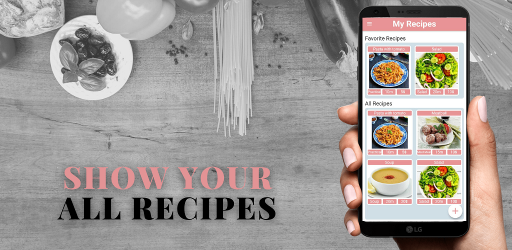
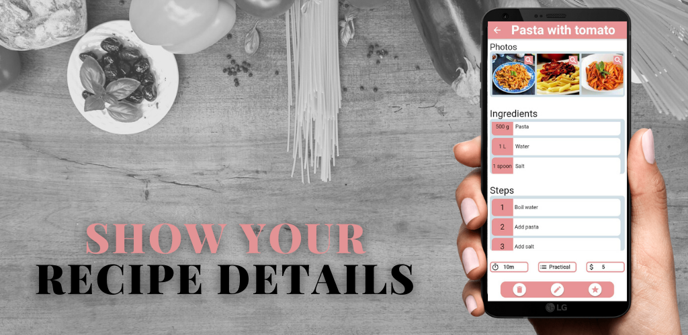
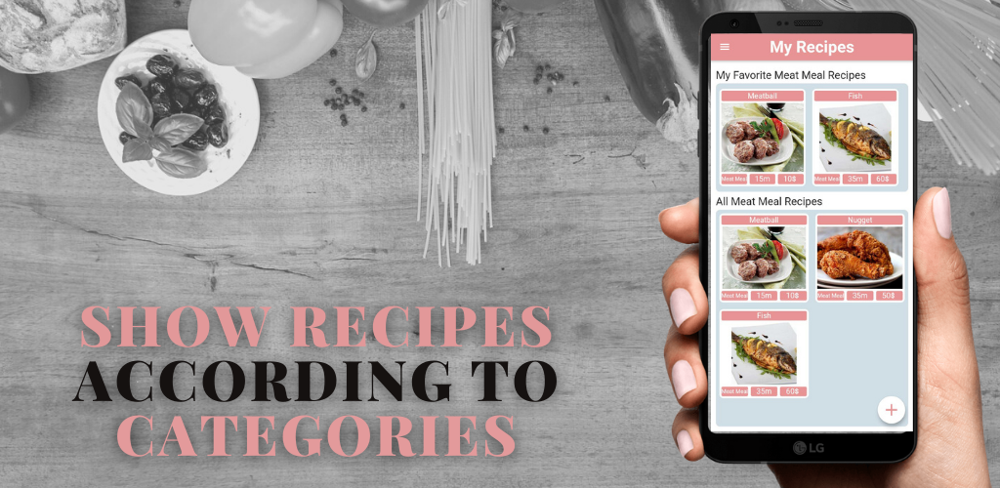
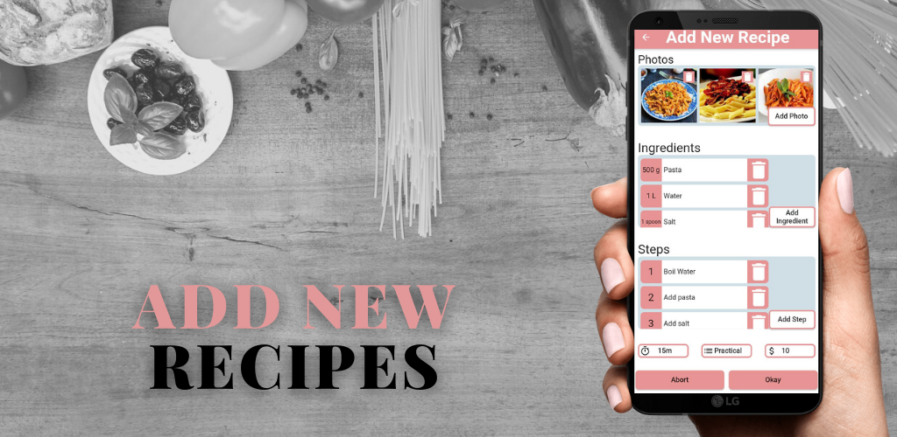

<h1 align="center"> My Recipes App</h1>   

 &nbsp;

<!-- START doctoc generated TOC please keep comment here to allow auto update -->
<!-- DON'T EDIT THIS SECTION, INSTEAD RE-RUN doctoc TO UPDATE -->

## Table of Contents

- [Table of Contents](#table-of-contents)
- [Introduction](#introduction)
- [Images](#images)
- [Technologies](#technologies)

<!-- END doctoc generated TOC please keep comment here to allow auto update -->

 

## Introduction

My Cook Recipes is a mobile app that lets you easily add and review your own recipes. Developed with Flutter, Dart, and SQL, you can create recipes with photos, steps, ingredients, price, duration, and more, and categorize them into different meal categories.

 

## Images

 &nbsp;
 &nbsp;
 &nbsp;
 &nbsp;

 

## Technologies

- Flutter
- Hive
